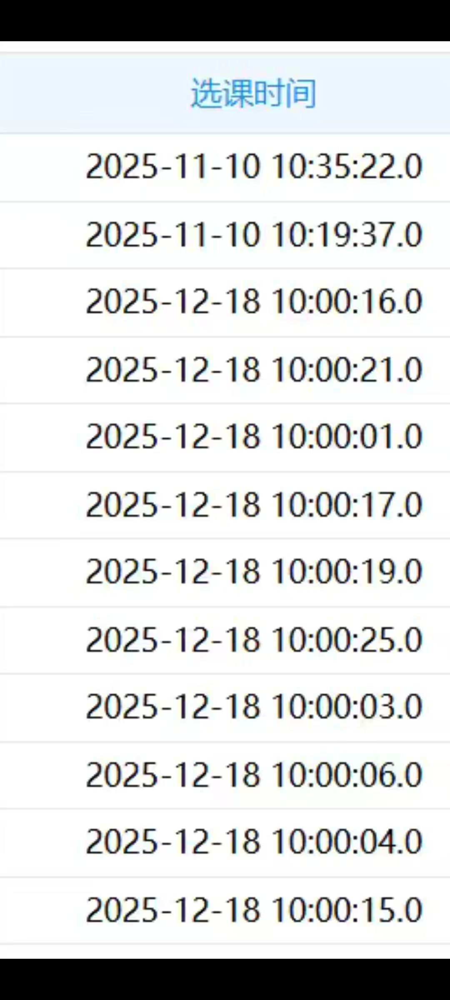
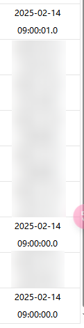

# QFNU Course Grabber

> 曲阜师范大学自动化抢课工具

## 工具简介

QFNU Course Grabber 是专为曲阜师范大学（QFNU）学生打造的自动化选课工具。通过模拟教务系统请求，在选课开放的第一时间自动完成课程抢选，帮助你告别选课卡顿的焦虑。

## 功能特点

- **自动登录** — 支持 CAS 统一认证，自动完成登录流程
- **多轮次抢课** — 自动识别可用选课轮次，按关键字优先级排序
- **智能搜索选课** — 按课程名称、教师姓名、上课时间自动匹配目标课程
- **高级模式** — 支持直接指定课程 ID（jx02id/jx0404id），精准抢课
- **五模块全覆盖** — 自动遍历专业内跨年级、本学期计划、公选课、选修课、计划外等全部选课模块
- **定时抢课** — 设置选课开始时间，程序自动等待并在准点发起请求
- **分组互斥** — 同组课程抢到一门自动跳过其余，避免课程冲突
- **钉钉通知** — 选课成功/失败实时推送到钉钉机器人
- **可视化配置** — 内置 Web 配置界面，浏览器中轻松编辑课程配置
- **会话保活** — 自动检测会话过期并重新登录，确保长时间运行稳定

## 使用方法

### 1. 下载或克隆本仓库

- 从本仓库[下载最新版本的压缩包](https://github.com/W1ndys/QFNUCourseGrabber-One-Release/archive/refs/heads/main.zip)并解压。
- 或者使用 Git 克隆仓库：

```bash
git clone git@github.com:W1ndys/QFNUCourseGrabber-One-Release.git
```

### 2. 配置

双击运行 `qfnu-courses-grabber-go-release.exe`，选择 **编辑配置** 进入 Web 配置界面（浏览器会自动打开 `http://127.0.0.1:8399`），填写以下信息：

| 配置项           | 说明                                   |
| ---------------- | -------------------------------------- |
| 学号             | 教务系统登录学号                       |
| 密码             | 教务系统登录密码                       |
| 轮次关键字       | 选课轮次名称中的关键字（如"2022补选"） |
| 开始时间         | 选课开放时间，格式 `09:59:00`          |
| 课程列表         | 添加要抢的课程，支持搜索模式和高级模式 |
| 钉钉通知（可选） | 填写 Webhook 地址和 Secret 以接收通知  |

配置完成后保存，会自动生成 `config.json` 文件。

### 3. 开始抢课

再次运行程序，选择 **开始抢课**，程序会：

1. 自动登录教务系统
2. 等待到设定的开始时间
3. 自动搜索并选课
4. 通过钉钉推送选课结果

### 4. 选课模式说明

**搜索模式**（推荐）：填写课程名称、教师姓名等信息，程序自动搜索匹配

**高级模式**：直接填写教务系统课程的 `jx02id` 和 `jx0404id`，跳过搜索直接提交选课请求

## 效果展示

以下为选课时间记录截图，可以看到程序在选课开放的瞬间完成了选课：

<p align="center">
  
  
  
</p>

## 常见问题

**Q：程序提示授权失败？**
A：为防止本程序被滥用或贩卖，本程序采用授权机制，请联系开发者获取使用授权。

**Q：选课失败提示"人数已满"？**
A：该课程确实已被选满，建议多配置几门备选课程或使用分组互斥功能。

**Q：如何同时抢多门课？**
A：在配置界面添加多门课程即可，程序会依次尝试选课。同组课程抢到一门会自动跳过同组其他课程。

## 注意事项

- 使用本工具时请确保遵守学校的选课规定，避免因使用自动化工具导致账号被封禁等问题
- 本工具仅供学习和研究使用，请勿用于商业用途
- 使用本软件所产生的一切后果由使用者自行承担
- 为防止脚本滥用及倒卖，本程序已做加密授权处理，如需使用请联系开发者获取授权
- 本程序禁止在未经允许的情况下进行反编译、逆向工程等行为
- 本程序禁止在未经允许的情况下进行二次分发、二次打包等行为
- 开发者无法保证本程序在所有环境下均能正常运行，使用者需自行承担风险
- 本程序可能会违反学校相关规定，使用者需自行判断并承担相应责任
- 本程序不会公开一切处理逻辑细节，请勿要求提供源代码
- **使用本程序即表示您已阅读并同意以上全部条款**
