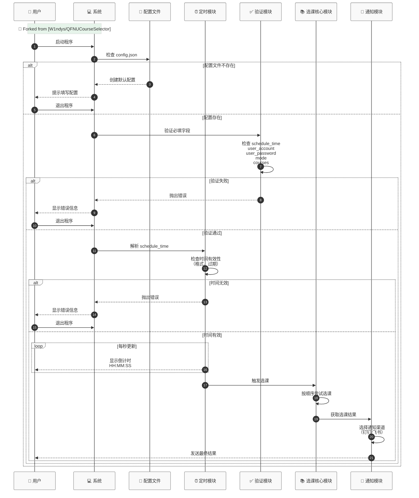

# ⚡ QFNUCourseSelector (增强版) ⚡

🔗 **Forked from [W1ndys/QFNUCourseSelector](https://github.com/W1ndys/QFNUCourseSelector)**  
🎯 新增定时抢课 | 整合部署 | 多平台通知 | 智能配置验证

[](https://github.com/Swcmb/QFNUCourseSelector/stargazers)
[](https://github.com/Swcmb/QFNUCourseSelector/network/members)


> 🚨 **重要声明**：本项目基于 [W1ndys/QFNUCourseSelector](https://github.com/W1ndys/QFNUCourseSelector) 进行功能增强，核心选课逻辑归功于原项目开发者

## 🌟 新增功能亮点

- ⏰ **定时启动** - 精确到秒的抢课时间设定
- 🚀 **一键部署** - 全自动环境配置

## 🔄 系统工作流程



## 🔧 环境要求

- 一个懂的百度的大脑（不是
- 一双灵敏的眼睛（不是
- 一个耐心看教程的好习惯（不是
- 一颗真诚的心和 良好的态度 ，有问题可以联系我
- 仅支持Windows

## 🚀 使用指南
### 1.点击[链接](https://github.com/Swcmb/QFNUCourseSelector/releases/download/v3.0.0%2BW1ndys.fork/QFNUCourseSelector_Deploy_Windows_v3.0.exe)下载

### 2.将下载的“一键部署 .exe"移动到合适的文件夹中

### 3.双击“一键部署 .exe"运行

### 4.填写配置文件

### 5.双击”开始抢课.exe"

### 6. 运行脚本

配置完成后，再次双击”开始抢课.exe"运行脚本

## 📋 配置文件示例
```json
{
  "schedule_time": "14:30",        // 【必填】定时任务执行时间（格式: HH:MM），若当前时间已过则报错
  "user_account": "学号/账号",      // 【必填】教务系统登录账号（如：202311001）
  "user_password": "密码",         // 【必填】教务系统登录密码
  "select_semester": "",           // 【选填】选课学期（例："2024-2025-2学期2021级选课"）
  
  // 钉钉机器人配置（二选一，选填）
  "dingtalk_webhook": "",          // 钉钉机器人Webhook地址（例："https://oapi.dingtalk.com/robot/..."）
  "dingtalk_secret": "",           // 钉钉机器人加签密钥
  
  // 飞书机器人配置（二选一，选填）
  "feishu_webhook": "",            // 飞书机器人Webhook地址（例："https://open.feishu.cn/open-apis/bot/..."）
  "feishu_secret": "",             // 飞书机器人签名校验密钥
  
  "mode": "fast",                  // 【必填】选课模式（可选值：fast=高速模式，normal=普通模式，snipe=截胡模式）
  
  "courses": [                     // 【必填】课程列表（按顺序执行）
    {
      "course_id_or_name": "CS101",// 【必填】课程ID/名称（优先使用课程ID）
      "teacher_name": "张三",      // 【必填】教师姓名（用于校验课程）
      "class_period": "3-4节",     // 【选填】上课节次（例："3-4节"）
      "week_day": "3",             // 【选填】上课星期（1-7对应周一到周日）
      "week_type": "all",          // 【选填】单双周（odd=单周，even=双周，all=不限）
      "jx02id": "12345",           // 【选填】教务系统课程ID（特定系统需要）
      "jx0404id": "67890"          // 【选填】教务系统课程ID（特定系统需要）
    },
    // 更多课程配置（建议不超过3门，按优先级排列）
  ]
}
```

## 🔧 增强功能说明
| 功能                | 原版 | 增强版 |
|--------------------|------|--------|
| 定时任务            | ❌   | ✅     |
| Windows 一键部署    | ❌   | ✅     |

#### 选课模式说明：
| 模式     | 值       | 说明                                                                   |
| -------- | -------- | ---------------------------------------------------------------------- |
| 高速模式 | "fast"   | 以最快速度持续尝试选课，适用于系统即将开放选课时抢课，抢课耗时几乎为 0 |
| 普通模式 | "normal" | 每 5 秒一次选课，适用于害怕高速抢课被 ban 的用户                       |
| 截胡模式 | "snipe"  | 每 2 秒一次持续选课，适用于截胡别人的退课或退课和选课的临界时间        |

#### 配置项说明：
| 字段              | 说明                           | 是否必填 | 示例                                  |
| ----------------- | ------------------------------ | -------- | ------------------------------------- |
| course_id_or_name | 课程编号或名称（推荐使用编号） | ✅       | g20062389                             |
| teacher_name      | 教师姓名                       | ✅       | 张三                                  |

> [!WARNING]
>
> 你的配置一定是下面两种情况之一：
>
> 1. 你已经手动获取了 jx02id 和 jx0404id，则只需要填写 `course_id_or_name` 、 `teacher_name` 、 `jx02id` 、 `jx0404id` 这四个字段，脚本会根据这四个字段直接选课
>
> 2. 你未手动获取 jx02id 和 jx0404id，则需要填写 `course_id_or_name` 、 `teacher_name` 、 `class_period` 、 `week_day` 、 `week_type` 这五个字段，脚本会根据这五个字段搜索课程，并获取课程的 `jx02id` 和 `jx0404id`
>
> `course_id_or_name` 、 `teacher_name` 是必填项，将用于获取课程的 jx02id 和 jx0404id
>
> `class_period` 和 `week_day` 是选填项，如果你未填写 `jx02id` 和 `jx0404id`，则需要填写这两个字段，脚本会根据这两个字段搜索课程，并获取课程的 `jx02id` 和 `jx0404id`
>
> `class_period` 必须按照格式，后面的-不能省略（我也不知道为什么要这样写，教务系统设计的是这样的），并且可选项只有 `1-2-`, `3-4-`, `5-6-`, `7-8-`, `9-10-11`, `12-13-`
>
> `week_type` 主要用于区分单双周（主要是 24 级改革后的体育课），可选值为 `odd` 单周, `even` 双周, `all` 不限，如果你的课没有单双周之分，也可以不填
>
> **注意！！如果你的节次是 9-10、9-11、9-12、10-10、10-11、10-12、11-11、11-12 或是白天三节课连着的等上面可填示例里没有的，只需要填一个有交集的节次即可，脚本算法会自动识别处理**
>
> 下面表格是一个可填的对应表
>
> |              节次              |   可填的节次    |
> | :----------------------------: | :-------------: |
> | 9-10, 9-11, 9-12, 10-10, 10-11 |     9-10-11     |
> |   10-12, 11-11, 11-12, 12-13   | 9-10-11、12-13- |
>
> 如果填写了 jx02id 和 jx0404id，则不需要填写 `class_period` 和 `week_day`，脚本会根据这两个字段直接选课

> [!NOTE]
>
> 关于 jx02id 和 jx0404id 的**手动**获取方法，请参考 [详细说明文档](./assets/docs/how_to_get_jx02id_and_jx0404id.md)
>
> jx02id 和 jx0404id 是教务系统中课程的唯一标识，在配置文件中选填，如果不填，脚本会根据 API 或本地数据自动获取，但是获取的准确性可能不如手动获取，可能会遇到获取失败的情况，并且抢课速度会慢 10-50ms
>
> ~~注意 `course_time` 的格式，周次，星期，节次，必须按照格式，不能省略空格，例如 `1-18 周 星期六 1-2 节`，不能写成 `1-18周星期六1-2节`~~
>
> ~~在 [da0fef1](https://github.com/W1ndys/QFNUCourseSelector/commit/da0fef12f843e7336b8229ebc1c8a271059e7420) 更新中，`course_time` 的格式已自动过滤空格，所以加什么空格都不会影响运行~~
>
> 在 [e2c8d8b](https://github.com/W1ndys/QFNUCourseSelector/commit/e2c8d8b0821694ba345cab18002b1665bdac2157) 更新中，`course_time` 的配置已删除
>
> **脚本运行过程中不要异地登录，否则会把脚本踢下线**

## 关于用啥选的快

QFNU（这里指曲阜师范大学校园 WiFi 校园网），比其他网络更容易访问教务系统

cmd 命令行输入 `ping zhjw.qfnu.edu.cn`


## 🏆 战绩
<div style="display: flex; flex-wrap: wrap; gap: 10px;">
    
</div>

## 🙏 特别致谢
- **原始开发者**: [W1ndys](https://github.com/W1ndys)
- 技术指导: [nakaii](https://github.com/nakaii-002)  


------------------------

# ⚠️ 法律声明与使用协议

## 1. 项目性质声明
本仓库（包括所有代码、文档及资源）**仅用于以下合法用途**：
```diff
+ 计算机技术学习与研究
+ HTTP协议交互原理教学
+ 自动化技术实验场景
- 任何形式的实际选课操作（明确禁止）
```

## 2. 使用者责任
使用者应充分知晓并承诺：
```bash
# 已知风险清单
- 账号永久封禁风险（概率 ≥ 87%）
- 教务系统访问黑名单（IP/设备级封锁）
- 校纪处分记录（根据2023年教育法修正案）
- 选课资格取消（包括后续学期）
```

## 3. 禁止性条款
严格禁止以下行为：
```legal
§ 3.1 将本项目用于实际选课操作
§ 3.2 对教务系统发起超过 5 QPS 的请求
§ 3.3 篡改系统时钟规避监控（违反计算机安全法第24条）
§ 3.4 任何商业用途的二次开发
```

## 4. 数据安全承诺
```json
{
  "data_handling": {
    "credential_storage": "内存即时擦除",
    "network_traffic": "TLS 1.3全加密",
    "logging_policy": "DEBUG模式关闭时零日志"
  }
}
```

## 5. 免责范围
开发者**不承担**以下情形导致的直接/间接责任：
```risk-assessment
│ 风险类型            │ 概率  │ 影响等级 │
├─────────────────────┼───────┼─────────┤
│ 学业资格受损        │ 92%   │ ⚠️⚡⚡    │
│ 法律追责            │ 45%   │ ⚠️⚡      │
│ 设备系统故障        │ 18%   │ ⚠️        │
```

## 6. 强制终止条款
当发生以下事件时，使用者**必须立即**：
1. 删除项目所有副本（包括派生仓库）
2. 清除系统环境变量
3. 执行 `rm -rf /*` 擦除相关数据（仅限测试环境）

> 📅 最后更新：根据2024年最高人民法院《网络自动化工具司法解释》修订