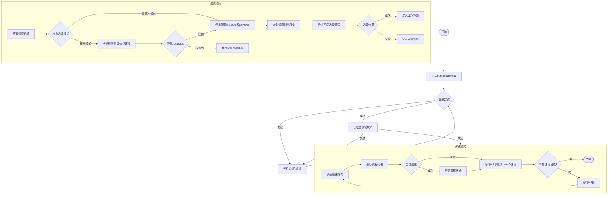

# QFNUCourseGrabberPy

> 曲阜师范大学 QFNU 抢课脚本 | 强智教务抢课脚本 | 强智教务 2017 | 大学抢课脚本 | 学院抢课脚本
>
> 本脚本以强智教务系统 2017 版本为基础，支持 2017 版本的所有功能，包括选修选课、专业内跨年级选课、本学期计划选课、公选课选课、计划外选课，其他版本未测试，但基本的请求 API 几乎类似，可以参考本脚本实现

## 本脚本初衷是为了告别卡顿页面，还学生一个流畅的选课体验，请谨慎使用，请勿滥用，请勿在大陆范围内所有社交媒体平台软件等传播，请勿用于商业用途

## ✨ 功能

- 🚀 通过发送请求包的方式选课，不依赖浏览器页面渲染，速度快的起飞
- 🎯 支持多种选课模块（选修选课、专业内跨年级选课、本学期计划选课、公选课选课、计划外选课）
- 📱 支持通知方式（飞书）
- 📚 支持多课程执行（courses 数组）
- ✅ 支持选课成功自动退出
- 🔄 支持选课失败智能重试或退出
- 📝 支持 loguru 日志记录
- ⚡ 提供快速启动脚本 quick_start.sh

## 📝 免责声明

> ⚠️ 使用本脚本前请仔细阅读以下声明

1. 本脚本初衷是为了告别卡顿页面，还学生一个流畅的选课体验，
2. 本脚本仅供学习和研究目的，用于了解网络编程和自动化技术的实现原理，禁止用于真实的选课环境。

3. 使用本脚本可能违反学校相关规定。使用者应自行承担因使用本脚本而产生的一切后果，包括但不限于：

   - 账号被封禁
   - 选课资格被取消
   - 受到学校纪律处分
   - 其他可能产生的不良影响

4. 严禁将本脚本用于：

   - 商业用途
   - 干扰教务系统正常运行
   - 影响其他同学正常选课
   - 其他任何非法或不当用途

5. 下载本脚本即视为您已完全理解并同意本免责声明。请在下载后 24 小时内删除。

6. 开发者对使用本脚本造成的任何直接或间接损失和后果不承担任何责任。

## 🔧 环境要求

- Python 3.12
- uv 虚拟环境

## 🚀 使用指南

### 1. 克隆项目

```bash
git clone git@github.com:W1ndys/QFNUCourseGrabberPy.git
```

### 2. 安装依赖

```bash
cd QFNUCourseGrabberPy
uv v
uv sync
```

### 3. 首次运行

```bash
uv run main.py
```

### 4. 配置文件说明

`config.json` 配置示例：

```json
{
  "user_account": "你的学号",
  "user_password": "你的教务系统密码",
  "feishu_webhook": "",
  "courses": [
    {
      "course_name": "你的课程名称",
      "course_id": "你的课程编号",
      "teacher_name": "你的老师名称",
      "jx02id": "",
      "jx0404id": "",
      "skxq": "",
      "skjc": "",
      "first_week": "",
      "first_xq": "",
      "first_jc": ""
    }
  ]
}
```

#### 选课模式说明

本脚本支持**两种选课模式**，可根据实际情况选择：

##### 模式一：直接 ID 模式（推荐）

- 直接填写 `jx02id` 和 `jx0404id`，脚本直接发送选课请求
- 速度最快，适合已知课程 ID 的情况

##### 模式二：搜索模式

- 不填写 `jx02id` 和 `jx0404id`，改为填写搜索参数
- 脚本会根据搜索参数自动查找课程并获取 ID 后选课
- 适合无法获取课程 ID 的情况

**蹲课机制：**

- 自动获取所有可用的选课轮次
- 依次遍历每个轮次进行选课尝试
- 一旦某课程在某轮次选课成功，则锁定该轮次，后续只在该轮次尝试
- 如果所有轮次全部失败，则从第一轮重新开始
- 每个课程之间固定间隔 **0.5 秒**
- 适用于补选中退选轮次的临界时间和正选中全天候蹲课

#### 配置项说明

| 字段         | 说明                         | 模式一（直接 ID） | 模式二（搜索） | 示例             |
| ------------ | ---------------------------- | ----------------- | -------------- | ---------------- |
| course_name  | 课程名称（用于日志输出）     | ✅ 必填           | ✅ 必填        | 高等数学         |
| course_id    | 课程编号                     | ✅ 必填           | ✅ 必填        | g20062389        |
| teacher_name | 教师姓名                     | ✅ 必填           | ✅ 必填        | 张三             |
| jx02id       | 课程 jx02id                  | ✅ 必填           | ❌ 留空        | 详见下方         |
| jx0404id     | 课程 jx0404id                | ✅ 必填           | ❌ 留空        | 详见下方         |
| skxq         | 星期几（1-7）                | ❌ 留空           | ✅ 必填        | 3                |
| skjc         | 节次范围                     | ❌ 留空           | ✅ 必填        | 1-2, 3-4, 5-6 等 |
| first_week   | 第一节课所在周次             | ❌ 留空           | ✅ 必填        | 1                |
| first_xq     | 第一节课星期几（1-7）        | ❌ 留空           | ✅ 必填        | 3                |
| first_jc     | 第一节课节次（01-13 两位数） | ❌ 留空           | ✅ 必填        | 09               |

**节次范围可选值：** `1-2`、`3-4`、`5-6`、`7-8`、`9-11`、`12-13`

> [!IMPORTANT]
>
> **配置要求（二选一）：**
>
> 1. **直接 ID 模式**：填写 `jx02id` 和 `jx0404id`，其他搜索参数留空
> 2. **搜索模式**：`jx02id` 和 `jx0404id` 留空，填写 `skxq`、`skjc`、`first_week`、`first_xq`、`first_jc`
>
> 两种模式不能混用，必须完整填写其中一种模式的所有必填字段。
<!-- -->
> [!NOTE]
>
> **关于 jx02id 和 jx0404id 的获取方法：**
>
> jx02id 和 jx0404id 是教务系统中课程的唯一标识，必须借助高年级账号手动获取
>
> 请确保在配置文件中填写正确，不要填反了，否则无法正常选课。
>
> **如果无法获取这两个 ID，可以使用搜索模式，填写课程的上课时间信息让脚本自动查找。**
>
> **脚本运行过程中不要异地登录，否则会把脚本踢下线**

## 程序流程图



### 流程说明

1. **初始化阶段**

   - 加载环境变量和配置文件
   - 初始化 loguru 日志系统
   - 建立会话连接

2. **登录阶段**

   - 获取验证码并识别
   - 尝试登录，失败后重试
   - 成功后获取选课轮次 ID

3. **蹲课模式**

   - 持续刷新选课轮次并尝试选课
   - 每个课程之间固定间隔 0.5 秒
   - 每轮选课完成后等待 0.5 秒开始新一轮

4. **选课流程**

   - **直接 ID 模式**：使用配置的 jx02id 和 jx0404id 直接选课
   - **搜索模式**：根据课程编号、教师、星期、节次搜索课程，通过 zcxqjcList 匹配第一节课信息确定目标课程
   - 查询课程剩余容量信息
   - 尝试不同类型的选课接口（专业内跨年级、本学期计划、公选课、选修、计划外）
   - 发送选课结果通知

5. **通知系统**
   - 支持飞书通知
   - 实时反馈选课状态

## ⚠️ 异常情况

### 报错下面内容

```py
TypeError:DdddOcr.__init__()got an unexpected keyword argument 'show_ad'
```

解决办法：<https://github.com/W1ndys/QFNUCourseGrabberPy/issues/8>

## 🏆 战绩

 

## 🌟 Star History

<!-- 添加 Star History -->
[](https://star-history.com/#W1ndys/QFNUCourseGrabberPy&Date)

## 🙏 致谢

特别感谢以下贡献者：

- [nakaii](https://github.com/nakaii-002) - 技术指导
- [上杉九月](https://github.com/sakurasep) - 技术指导
- [AuroBreeze](https://github.com/AuroBreeze) - 登录算法优化
- 超级大猫猫头头 - 测试支持

## 🔗 友情链接

- [使用 Python 实现的抢课脚本](https://github.com/AuroBreeze/QFNUClassSelector)

  > 注：该项目是另一位开发者的版本，借鉴了本项目部分代码，与本项目无从属关系，本项目开发者未参与该项目的开发

## 📄 许可证

本项目采用 [GNU General Public License v3 (GPLv3)](./LICENSE)。

特别说明：

1. 本项目仅供学习和研究使用
2. 严禁用于商业用途
3. 任何衍生项目必须使用相同许可证开源
