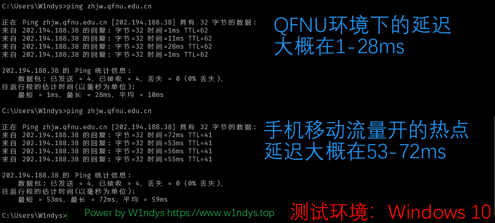
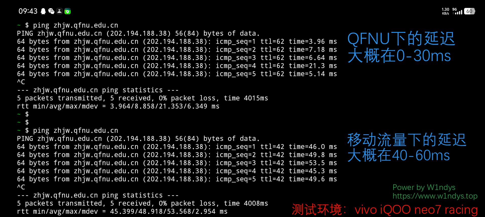
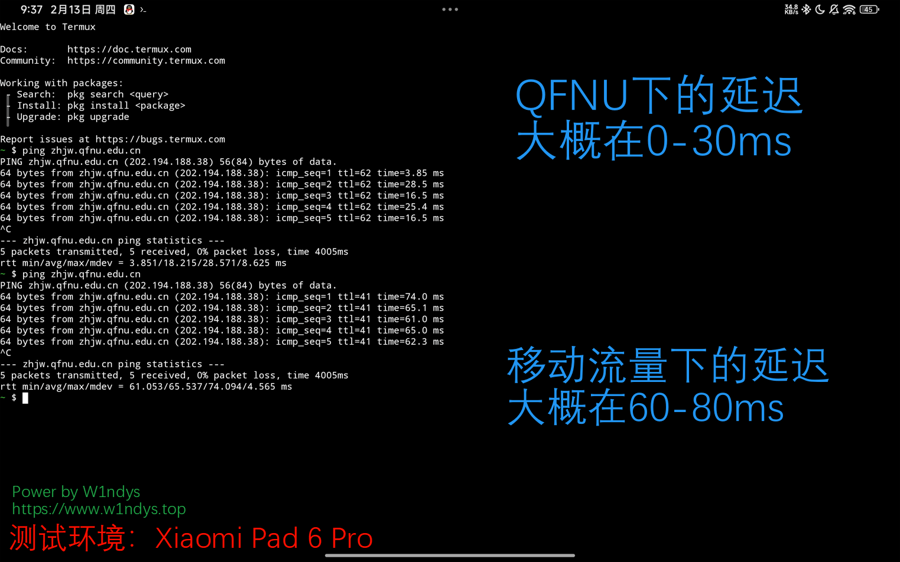

# QFNUCourseSelector

> QFNU 抢课脚本 | 强智教务抢课脚本 | 强智教务 2017

<p align="center">
    
    
    
    
    
</p>

<div align="center">
    <h1 >
        ✨ 请给我一个 Star! ✨
    </h1>
</div>

## ⚠️ 注意事项

~~**目前仅支持公选课抢课功能**~~

**目前支持全部选课功能（选修选课、专业内跨年级选课、本学期计划选课、公选课选课、计划外选课）**

## 📝 免责声明

> ⚠️ 使用本脚本前请仔细阅读以下声明

1. 本脚本仅供学习和研究目的，用于了解网络编程和自动化技术的实现原理。

2. 使用本脚本可能违反学校相关规定。使用者应自行承担因使用本脚本而产生的一切后果，包括但不限于：

   - 账号被封禁
   - 选课资格被取消
   - 受到学校纪律处分
   - 其他可能产生的不良影响

3. 严禁将本脚本用于：

   - 商业用途
   - 干扰教务系统正常运行
   - 影响其他同学正常选课
   - 其他任何非法或不当用途

4. 下载本脚本即视为您已完全理解并同意本免责声明。请在下载后 24 小时内删除。

5. 开发者对使用本脚本造成的任何直接或间接损失不承担任何责任。

## 🔧 环境要求

- Python 3.12.3（其他版本未经测试）
- pip 包管理器
- 支持 Windows/Linux/MacOS

## 🚀 使用指南

### 1. 克隆项目

```bash
git clone git@github.com:W1ndys/QFNUCourseSelector.git
```

> 直接下载zip包也可以，但是需要把bat文件的行位序列改成CRLF，否则会报错

### 2. 安装依赖

双击 `create_venv_windows.bat` 并等待安装完成

### 3. 首次运行

双击 `run_app_in_venv_windows.bat`，系统将自动生成配置文件 `config.json`

### 4. 配置文件说明

`config.json` 配置示例：

```json
{
  "user_account": "你的学号",
  "user_password": "你的密码",
  "select_semester": "你的选课学期，例如：2024-2025-2学期2021级选课",
  "dingtalk_webhook": "你的钉钉机器人webhook",
  "dingtalk_secret": "你的钉钉机器人secret",
  "course": [
    {
      "course_id_or_name": "课程id", // 必填
      "teacher_name": "教师名称", // 必填
      "week_day": "上课星期", // 选填(1-7)
      "class_period": "上课节次", // 选填
      "course_time": "完整的上课时间", // 必填
      "jx02id": "jx02id", // 选填
      "jx0404id": "jx0404id" // 选填
    }
    //...
    // 可以添加多个课程，脚本执行的时候从第一个开始依次执行
  ]
}
```

#### 配置项说明：

| 字段              | 说明                           | 是否必填 | 示例                               |
| ----------------- | ------------------------------ | -------- | ---------------------------------- |
| course_id_or_name | 课程编号或名称（推荐使用编号） | ✅       | g20062389                          |
| teacher_name      | 教师姓名                       | ✅       | 张三                               |
| week_day          | 上课星期                       | ❌       | 1-7 之间的数字                     |
| class_period      | 上课节次                       | ❌       | 1-2-,3-4-,5-6-,7-8-,9-10-11,12-13- |
| course_time       | 完整上课时间                   | ✅       | 1-18 周 星期六 1-2 节              |
| jx02id            | 公选课 jx02id                  | ❌       | -                                  |
| jx0404id          | 公选课 jx0404id                | ❌       | -                                  |

> [!NOTE]
>
> 关于 jx02id 和 jx0404id 的获取方法，请参考[详细说明文档](./assets/docs/how_to_get_jx02id_and_jx0404id.md)
>
> jx02id 和 jx0404id 是教务系统中课程的唯一标识，在配置文件中选填，如果不填，脚本会根据本地数据自动获取，但是获取的准确性可能不如手动获取，并且抢课速度会慢 10-50ms
>
> 上课节次必须按照格式，后面的-不能省略（我也不知道为什么要这样写，教务系统设计的是这样的）
>
> ~~注意`course_time`的格式，周次，星期，节次，必须按照格式，不能省略空格，例如`1-18 周 星期六 1-2 节`，不能写成`1-18周星期六1-2节`~~
>
> 在[da0fef1](https://github.com/W1ndys/QFNUCourseSelector/commit/da0fef12f843e7336b8229ebc1c8a271059e7420)中，`course_time`的格式已自动过滤空格，所以加什么空格都不会影响运行
>
> **脚本运行过程中不要异地登录，否则会把脚本踢下线**

### 5. 运行脚本

配置完成后，再次双击 `run_app_in_venv_windows.bat` 运行脚本

## 关于用啥选的快

直接点题：QFNU（这里指曲阜师范大学校园 WiFi 校园网），比其他网络更容易访问教务系统

cmd 命令行输入 `ping zhjw.qfnu.edu.cn`







可以很明显的看到，QFNU 的网络环境比其他网络环境更容易访问教务系统

以上环境是在网络通畅的情况下测试，所以几十毫秒的差距对正常使用来说几乎无感，在网络拥堵的情况下差距将进一步扩大

但是当选课服务器接近崩溃的时候，两者的差距几乎可以忽略不计，就变成大家都进不去

## 🏆 战绩


## 🙏 致谢

特别感谢以下贡献者：

- [nakii](https://github.com/nakaii-002) - 技术指导
- [上杉九月](https://github.com/sakurasep) - 技术指导
- 超级大猫猫头头 - 测试支持
- [Cursor](https://www.cursor.com/) - 开发工具支持

## 📄 许可证

本项目采用 MIT 许可证
