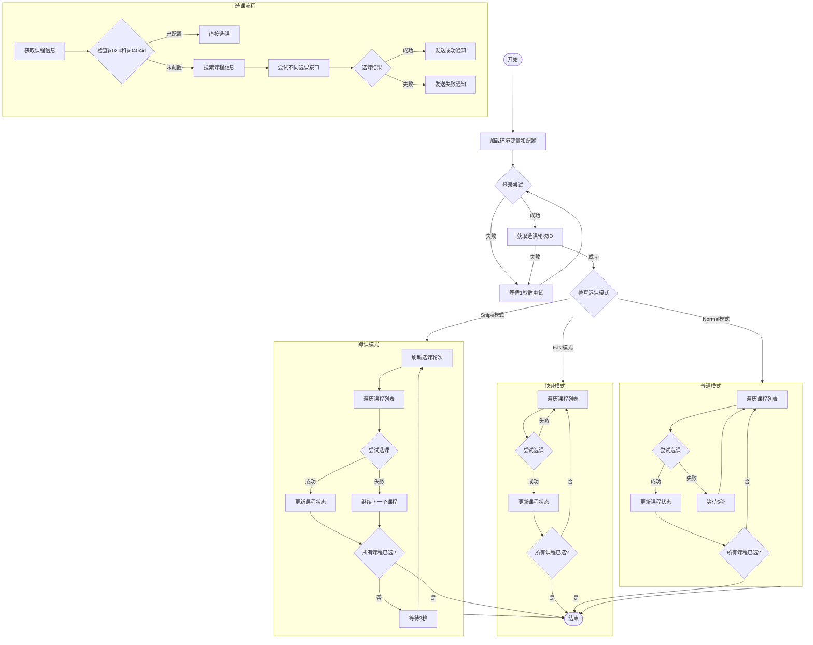

# QFNUCourseSelector

> 曲阜师范大学 QFNU 抢课脚本 | 强智教务抢课脚本 | 强智教务 2017 | 大学抢课脚本 | 学院抢课脚本
>
> 本脚本以强智教务系统 2017 版本为基础，支持 2017 版本的所有功能，包括选修选课、专业内跨年级选课、本学期计划选课、公选课选课、计划外选课，其他版本未测试，但基本的请求 API 几乎类似，可以参考本脚本实现

[](https://deepwiki.com/W1ndys/QFNUCourseSelector)

## 本脚本初衷是为了告别卡顿页面，还学生一个流畅的选课体验，请谨慎使用，请勿滥用，请勿在大陆范围内所有社交媒体平台软件等传播

## 注意！！！！！！

## 2025 年 9 月 24 日公告：本项目具有严重的安全风险和非预期运行，有极大概率无法正常的选课，为避免影响正常选课，请勿继续使用，相关代码仅供学习研究使用，请勿用于实际的选课环境中，使用脚本造成的一切后果与开发者无关

## ✨ 功能

- 🚀 通过发送请求包的方式选课，不依赖浏览器页面渲染，速度快的起飞
- 🎯 支持多种选课功能（选修选课、专业内跨年级选课、本学期计划选课、公选课选课、计划外选课）
- 📱 支持多种通知方式（飞书）
- 🔄 支持多种选课模式（高速模式、普通模式、蹲课模式）
- 👥 支持多账号执行（批量启动）
- 📚 支持多课程执行（courses 数组）
- 💻 支持多系统执行（Windows、Linux、MacOS）
- ⏰ 支持多种节次配置
- 📅 支持多种周次配置
- ✅ 支持选课成功自动退出
- 🔄 支持选课失败自动重试
- 📝 支持日志记录，不会因为程序运行结束而丢失日志
- 🛠️ 支持环境部署脚本化，就算是傻瓜也可以一键部署~
- ⚡ 已实现抢课 0 耗时
- 🛠️ 提供网页版配置生成器，轻松生成配置文件

## 📝 免责声明

> ⚠️ 使用本脚本前请仔细阅读以下声明

1. 本脚本初衷是为了告别卡顿页面，还学生一个流畅的选课体验，
2. 本脚本仅供学习和研究目的，用于了解网络编程和自动化技术的实现原理，禁止用于真实的选课环境。

3. 使用本脚本可能违反学校相关规定。使用者应自行承担因使用本脚本而产生的一切后果，包括但不限于：

   - 账号被封禁
   - 选课资格被取消
   - 受到学校纪律处分
   - 其他可能产生的不良影响

4. 严禁将本脚本用于：

   - 商业用途
   - 干扰教务系统正常运行
   - 影响其他同学正常选课
   - 其他任何非法或不当用途

5. 下载本脚本即视为您已完全理解并同意本免责声明。请在下载后 24 小时内删除。

6. 开发者对使用本脚本造成的任何直接或间接损失和后果不承担任何责任。

## 🔧 环境要求

- Python 3.12
- uv 虚拟环境

## 🚀 使用指南

### 1. 克隆项目

```bash
git clone git@github.com:W1ndys/QFNUCourseSelector.git
```

> 直接下载 zip 包也可以，但是需要把 bat 文件的行位序列改成 CRLF，否则会报错

### 2. 安装依赖

```bash
cd QFNUCourseSelector
uv v
uv pip install -r requirements.txt
```

### 3. 首次运行

```bash
uv run main.py
```

### 4. 配置文件说明

`config.json` 配置示例：

```json
{
  "user_account": "你的学号", // 必填
  "user_password": "你的密码", // 必填
  "select_semester": "你的选课学期，例如：2024-2025-2学期2021级选课", // 选填
  "feishu_webhook": "你的飞书机器人webhook", // 选填
  "mode": "选课模式", // 选课模式，fast: 高速模式，normal: 普通模式，snipe: 蹲课模式
  "courses": [
    {
      "course_id_or_name": "课程id或名称", // 必填，用于日志输出
      "teacher_name": "教师名称", // 必填，用于日志输出
      "jx02id": "课程jx02id", // 必填，用于选课请求和查询剩余容量
      "jx0404id": "课程jx0404id" // 必填，用于选课请求和查询剩余容量
    }
    //...
    // 可以添加多个课程，脚本执行的时候从第一个开始依次执行
  ]
}
```

#### 选课模式说明：

| 模式     | 值     | 说明                                                                   |
| -------- | ------ | ---------------------------------------------------------------------- |
| 高速模式 | fast   | 以最快速度持续尝试选课，适用于系统即将开放选课时抢课，抢课耗时几乎为 0 |
| 普通模式 | normal | 每 5 秒一次选课，适用于害怕高速抢课被 ban 的用户                       |
| 蹲课模式 | snipe  | 每 2 秒一次持续选课，适用于补选中退选轮次的临界时间和正选中全天候蹲课  |

> 如果不填填错，脚本会默认使用蹲课模式

#### 配置项说明：

| 字段              | 说明                                        | 是否必填 | 示例      |
| ----------------- | ------------------------------------------- | -------- | --------- |
| course_id_or_name | 课程编号或名称（用于日志输出）              | ✅       | g20062389 |
| teacher_name      | 教师姓名（用于日志输出）                    | ✅       | 张三      |
| jx02id            | 课程 jx02id（用于选课请求和查询剩余容量）   | ✅       | 详见下方  |
| jx0404id          | 课程 jx0404id（用于选课请求和查询剩余容量） | ✅       | 详见下方  |

> [!IMPORTANT]
>
> **新版配置要求：**
>
> 从本版本开始，`jx02id` 和 `jx0404id` 为 **必填项**，必须手动获取并填写到配置文件中。
>
> - `course_id_or_name` 和 `teacher_name`：必填，仅用于日志输出，方便查看选课记录
> - `jx02id` 和 `jx0404id`：必填，用于实际的选课请求操作和查询课程剩余容量
>
> 脚本会自动通过这两个 ID 查询课程的剩余容量信息，无需配置上课时间、节次等额外参数，极大简化了配置流程。

> [!NOTE]
>
> **关于 jx02id 和 jx0404id 的获取方法：**
>
> jx02id 和 jx0404id 是教务系统中课程的唯一标识，必须手动获取。详细的获取方法请参考 [详细说明文档](./assets/docs/how_to_get_jx02id_and_jx0404id.md)
>
> 请确保在配置文件中填写正确，不要填反了，否则无法正常选课。
>
> **脚本运行过程中不要异地登录，否则会把脚本踢下线**

### 5. 运行脚本

Windows 用户双击 `run_app_in_venv_windows.bat` 运行脚本

Linux 用户执行 `bash run_app_in_venv_linux.sh` 运行脚本

## 程序流程图



### 流程说明

1. **初始化阶段**

   - 加载环境变量和配置文件
   - 初始化日志系统
   - 建立会话连接

2. **登录阶段**

   - 获取验证码并识别
   - 尝试登录，失败后重试
   - 成功后获取选课轮次 ID

3. **选课模式**

   - Fast 模式：以最快速度持续尝试选课
   - Normal 模式：每次选课后等待 5 秒
   - Snipe 模式：持续刷新选课轮次并尝试选课

4. **选课流程**

   - 获取课程信息
   - 检查是否已配置课程 ID
   - 尝试不同类型的选课接口
   - 发送选课结果通知

5. **通知系统**
   - 支持飞书通知
   - 实时反馈选课状态

## ⚠️ 异常情况

### 报错下面内容

```py
TypeError:DdddOcr.__init__()got an unexpected keyword argument 'show_ad'
```

解决办法：https://github.com/W1ndys/QFNUCourseSelector/issues/8

## 🏆 战绩

<div style="display: flex; flex-wrap: wrap; gap: 10px; justify-content: center;">
    
    
</div>

## 🌟 Star History

<!-- 添加 Star History -->
<p align="center">
  <a href="https://star-history.com/#W1ndys/QFNUCourseSelector&Date">
    <picture>
      <source media="(prefers-color-scheme: dark)" srcset="https://api.star-history.com/svg?repos=W1ndys/QFNUCourseSelector&type=Date&theme=dark" />
      <source media="(prefers-color-scheme: light)" srcset="https://api.star-history.com/svg?repos=W1ndys/QFNUCourseSelector&type=Date" />
      
    </picture>
  </a>
</p>

## 🙏 致谢

特别感谢以下贡献者：

- [nakaii](https://github.com/nakaii-002) - 技术指导
- [上杉九月](https://github.com/sakurasep) - 技术指导
- [AuroBreeze](https://github.com/AuroBreeze) - 登录算法优化
- 超级大猫猫头头 - 测试支持

## 🔗 友情链接

- [使用 Python 实现的抢课脚本](https://github.com/AuroBreeze/QFNUClassSelector)

  > 注：该项目是另一位开发者的版本，借鉴了本项目部分代码，与本项目无从属关系，本项目开发者未参与该项目的开发

## 📄 许可证

本项目采用 [GNU General Public License v3 (GPLv3)](./LICENSE)。

特别说明：

1. 本项目仅供学习和研究使用
2. 严禁用于商业用途
3. 任何衍生项目必须使用相同许可证开源
