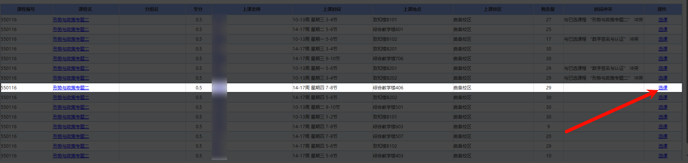

# 如何获取 jx02id 和 jx0404id

获取 jx02id 和 jx0404id 需要高年级账号，因为高年级账号会比低年级账号提前选课

## 进入选课页面

按照正常流程进入选课页面即可

## 找到目标课程

有些同学不知道目标课程会在哪个分类，分类是根据年级、专业等来决定的，所以同一节课对于不同年级、不同专业的同学来说，可能出现在不同的分类中，需要自己手动搜索

## 获取 jx02id 和 jx0404id

在选课页面中，找到目标课程，点击课程名称，会跳转到课程详情页面，在课程详情页面中，右键`选课`按钮，复制链接

例如你想选`形势与政策`，找到你想选的课程，想选的老师、时间等，然后右键`选课`按钮，复制链接



你会得到形如下面的内容

```
javascript:xsxkFun('***************','********************************','null');
```

前面是 `jx0404id`(一般是纯数字，较短)，后面是 `jx02id`(一般是数字加大写字母的组合，较长，还有一种可能是和课程编号一样)，复制这两个 id，然后粘贴到配置文件中即可
