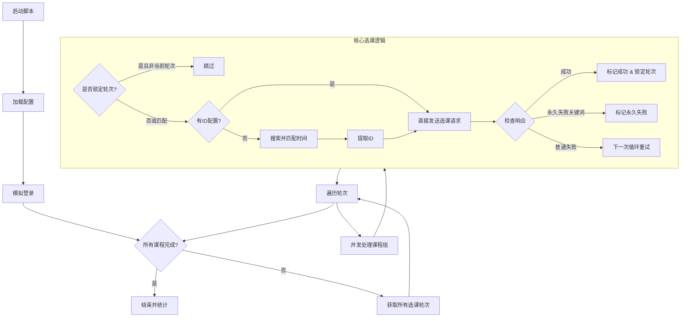

# 🔄 总体流程概览

脚本采用 **“多轮次扫描 + 异步并发 + 状态锁定”** 的策略。它会不断循环获取学校开放的所有选课轮次，在每个轮次中尝试对配置的课程进行搜索或直接抢课。一旦某门课在某个轮次成功或被判定无法选取（如冲突、人数已满），会锁定状态以避免无效请求。

## 📝 详细步骤拆解

### 1. 初始化与配置加载 (`main.py`)

* **读取配置**：加载 `config.json`。
* **双模式支持**：
  * **精准模式**：直接配置 `jx02id` 和 `jx0404id`（课程的内部唯一标识），跳过搜索直接抢。
  * **搜索模式**：配置课程编号、教师名、上课时间（星期、节次），脚本会自动去搜寻匹配的 ID。
* **校验**：检查必填项，确保参数格式正确。

### 2. 模拟登录 (`main.py` & `src/utils`)

* **获取验证码**：访问验证码接口，使用 OCR (`src/utils/captcha_ocr.py`) 自动识别。
* **加密登录**：将账号密码进行 Base64 编码拼接，发送登录请求。
* **会话保持**：使用全局 `session` 保持 Cookie 状态。

### 3. 主选课循环 (`main.py` -> `select_courses`)

这是脚本的核心“蹲课”循环，直到所有课程抢到或确认无法抢到为止。

* **步骤 A：获取轮次**
  * 调用 `get_jx0502zbid` 获取当前系统开放的所有选课轮次（如“第一轮选课”、“补退选”等）。
* **步骤 B：遍历轮次**
  * 脚本依次遍历每一个轮次 ID。
* **步骤 C：并发抢课 (Group Task)**
  * 为了防止同一门课并发冲突，脚本将**同名同老师**的课程视为一个“组”。
  * 使用 `asyncio.gather` **并发执行**不同课程组的任务，提高效率。
* **步骤 D：轮次锁定机制 (关键优化)**
  * 一旦某门课在某个轮次抢课成功，会记录 `locked_rounds`。
  * 后续循环中，该课程将**只在该轮次**进行尝试，不再浪费资源扫描其他轮次。

### 4. 核心选课执行策略 (`src/core/search_and_select_course.py`)

当处理单门课程时，逻辑如下：

* **场景一：已知 ID (精准模式)**
    1. 脚本依次尝试 **5 个选课模块**接口（专业内跨年级、本学期计划、公选课、选修、计划外）。
    2. 直接发送选课请求。
    3. **搜到即停**：只要在一个模块成功，即标记完成。

* **场景二：未知 ID (搜索模式)**
    1. **搜索**：在每个选课模块的搜索接口（如 `xsxkKnjxk`）根据课程编号和教师搜索。
    2. **匹配**：解析搜索结果，对比用户配置的 `class_times`（周次、星期、节次）。
        * 只有当搜索结果的时间包含用户配置的所有时间点时，才视为匹配。
    3. **提取 ID**：从匹配结果中拿到 `jx02id` 和 `jx0404id`。
    4. **抢课**：立即利用提取的 ID 发送选课请求。

### 5. 请求发送与结果判定 (`src/core/send_course_data.py`)

* **发送请求**：构造特定模块的 GET 请求，携带 `kcid` 和 `jx0404id`。
* **结果解析**：
  * ✅ **成功**：返回 `True`，通过飞书推送通知，停止该课程后续尝试。
  * ❌ **普通失败**：如“当前不在选课时间”，返回 `False`，脚本会在下一轮循环继续尝试。
  * 🚫 **永久失败**：如果返回消息包含关键词（**"人数已满"**, **"冲突"**, **"教学班"**, **"限制"**），脚本判定该课无法选取，标记为 `"permanent_failure"`，**彻底停止**该课程的尝试，防止死循环刷接口导致封号。

## 📊 逻辑流程图解

## 💡 总结

该脚本通过**多接口轮询**（覆盖5种选课入口）和**智能搜索匹配**解决了找不到选课入口的问题，并通过**并发**和**轮次锁定**机制保证了抢课的速度和稳定性，同时具备防止无效死刷的熔断机制（永久失败判定）。
